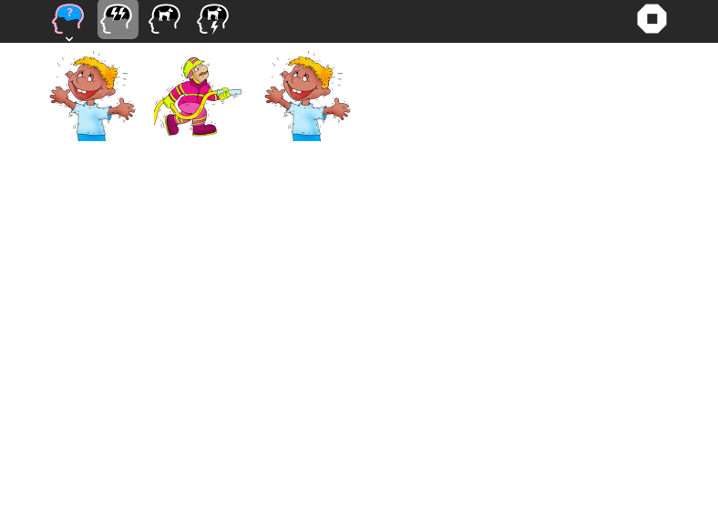
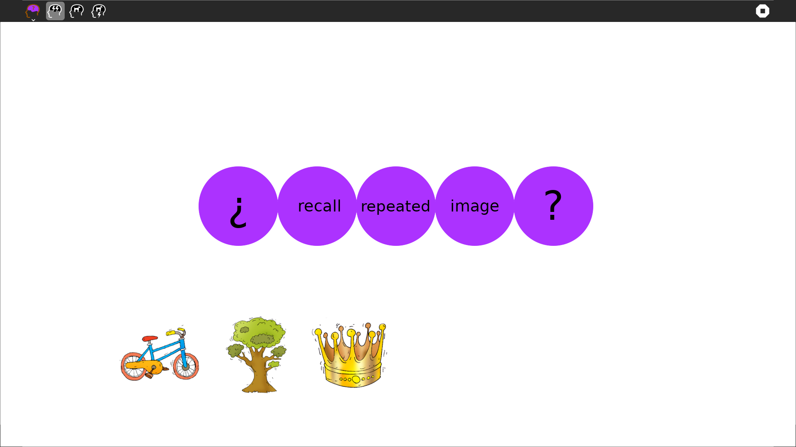
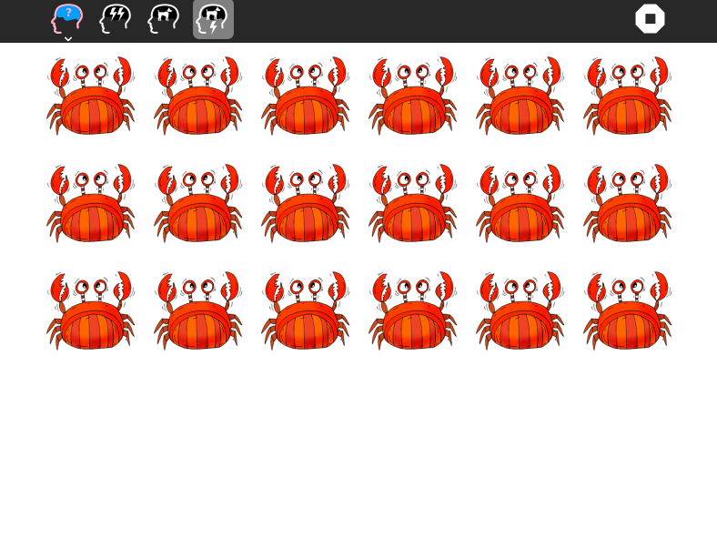
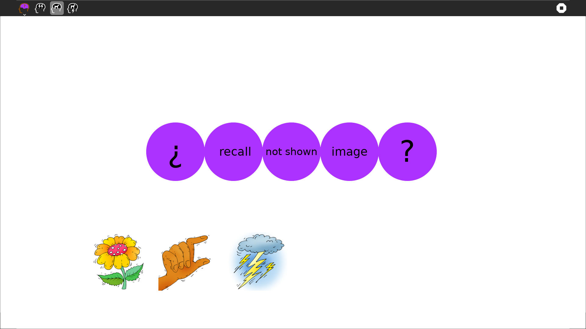

Recall Activity 
===============

The Recall Activity is a series of three memory games, each of increasing difficulty.

How to use?
===============
Recall is not a part of Sugar Desktop but can be added. Refer to the following links-

* [How to Get Sugar on sugarlabs.org](https://sugarlabs.org/), 
* [How to use Sugar](https://help.sugarlabs.org/), and;
* [How to use Recall](https://wiki.sugarlabs.org/go/Activities/Recall) 

The first game prompts the learner to observe which images are repeated in the grid. It starts easy, with just three images, but as more images are added, it becomes more challenging.
The second game prompts the user to identify the image which had not appeared in the grid. Again, it starts easy, with just three images to remember, but gets very challenging as the number of images increases.
The third game (an "n-back"-style game) shows images in sequence and prompts the learner to recall which image came earlier. First is asked for the image that was present just previously; then two-previously,... up to six previously.

How to upgrade?
===============
On Sugar Desktop systems;

* [Use My Settings,](https://help.sugarlabs.org/my_settings.html) [Software Update](https://help.sugarlabs.org/my_settings.html#software-update) 
* [Use Browse to open ](https://activities.sugarlabs.org/)activities.sugarlabs.org Search for Recall, then download
